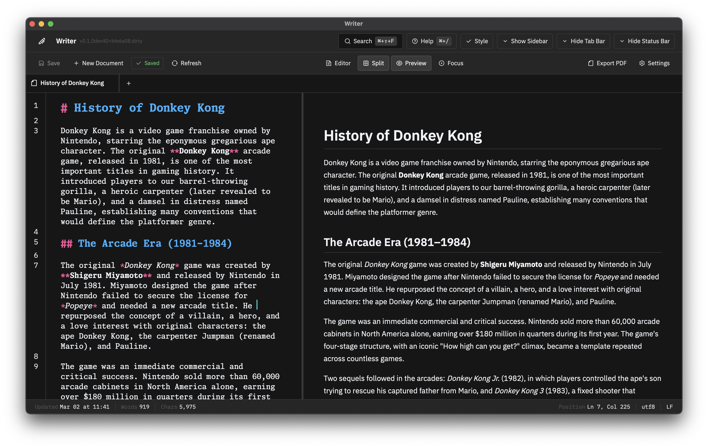
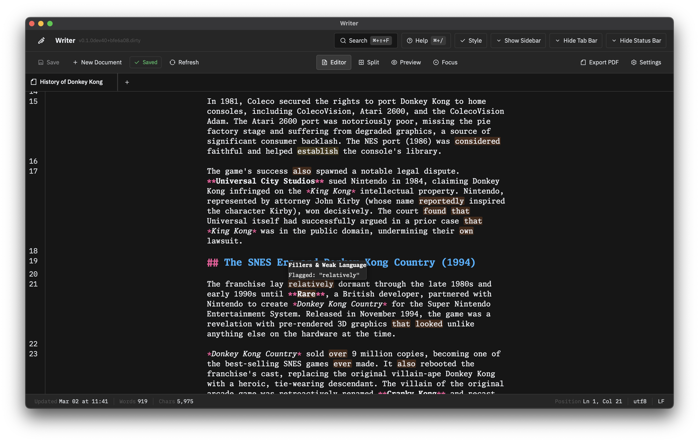
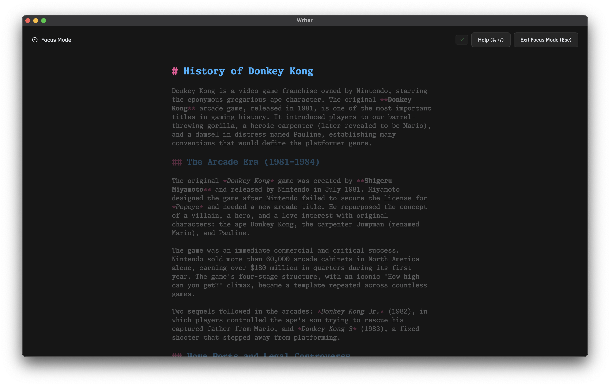
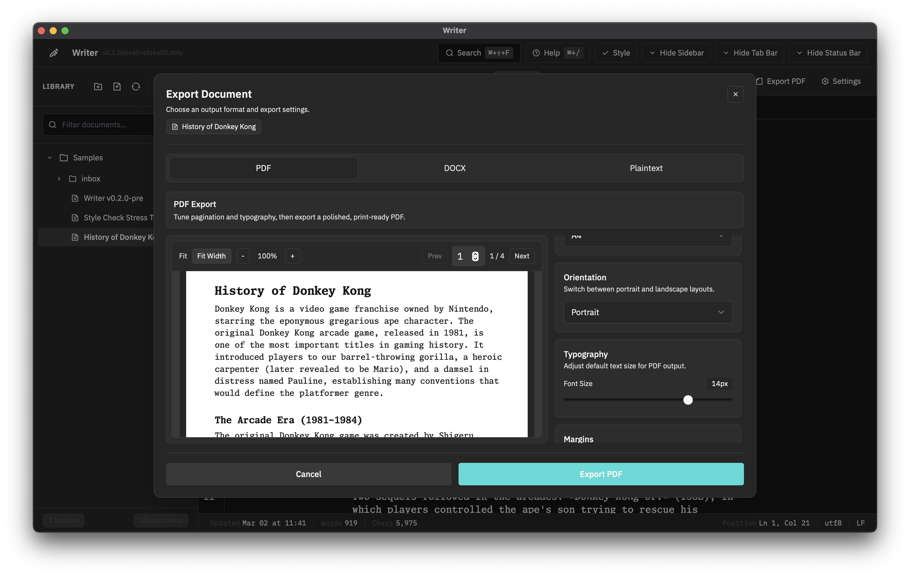

<!-- markdownlint-disable MD033 -->
# Writer

Writer is a Tauri desktop writing app with a React frontend and a Rust backend. It treats user-selected folders as the source of truth, keeps app state in Rust-backed persistence, and layers focused writing, file management, and export workflows on top.



## Highlights

- Markdown editor with live preview, split view, preview-only mode, and focus mode
- Workspace model built around user-selected folders ("locations")
- Sidebar file management with drag-and-drop moves, nested folders, and context menu operations
- Multi-document tabs with Rust-backed session restore
- Rule-based writing assistance with style check diagnostics and parts-of-speech highlighting
- Quick Capture window (`#/quick-capture`) for global shortcut capture flows
- Export dialog with PDF preview, DOCX export, plaintext export, and source-markdown save

### File Management

Move documents across folders and locations, create nested directories, and manage files from the sidebar without dropping into Finder or Explorer.

### Style Check

Real-time style feedback with inline decorations for filler words, redundancies, and clichés.



### Focus Mode

Typewriter scrolling and sentence/paragraph dimming for distraction-free writing.



### Quick Capture

Global hotkey opens a capture window from anywhere on your system.


### Export

Export polished PDFs with inline preview, Word-compatible DOCX files, clean plaintext, or save the raw markdown source.



## Development

<details>
<summary>Documentation</summary>

- [Architecture](docs/architecture.md)
- [State management](docs/state.md)
- [App lifecycle](docs/lifecycle.md)
- [Persistence](docs/persistence.md)
- [Exporting](docs/export.md)
- [PDF specifics](docs/pdf.md)
- [Release process](docs/release.md)

</details>

<details>
<summary>Tech Stack</summary>

- Frontend: React 19, TypeScript, Vite, Zustand, CodeMirror 6, Tailwind CSS
- Backend: Tauri 2, Rust workspace (`core`, `markdown`, `store`)
- Testing: Vitest + Testing Library (frontend), `cargo test` (Rust)

</details>

<details>
<summary>Development Commands</summary>

```sh
pnpm install
pnpm tauri dev
```

Useful commands:

```sh
pnpm lint
pnpm check
pnpm test:run
cargo test
```

</details>

<details>
<summary>Release</summary>

Before cutting a release, update the app version in `package.json`, `src-tauri/Cargo.toml`, and `src-tauri/tauri.conf.json`, finalize `CHANGELOG.md`, and follow [docs/release.md](docs/release.md).

</details>
